# 🦾 ESP32 4-DOF Robotic Arm with Custom Web Dashboard

A custom **ESP32-powered 4-DOF robotic arm** featuring a responsive, self-hosted web control interface. The system combines embedded C++, servo control, Wi-Fi communication, and custom motion-smoothing algorithms to provide smooth and precise robotic-arm movement.

The arm can be controlled wirelessly from a smartphone, tablet, or computer connected to the ESP32's Wi-Fi network. Users can control individual joints, adjust movement speed, save positions, and automate recorded motion sequences directly from a web browser.

---

## 🎥 Project Demonstration

See the **4-DOF Robotic Arm** in action, including real-time control through the ESP32-hosted web dashboard and automated arm movements.

▶️ **[Watch the 4-DOF Robotic Arm Demo on LinkedIn](https://www.linkedin.com/posts/pavan-kalyan-imandi_robotics-automation-embeddedsystems-activity-7468150726012215296-CXLO)**

---

## 📐 Degrees of Freedom

The robotic arm has **4 functional degrees of freedom (DOF)**:

* Base Rotation
* Shoulder
* Elbow
* Gripper

Although the system uses **5 servo motors**, the two SG90 servos used for the gripper operate together as a single functional gripper DOF.

---

## 📸 Final Prototype

| Side View                                               | Front / Main View                                       |
| ------------------------------------------------------- | ------------------------------------------------------- |
| 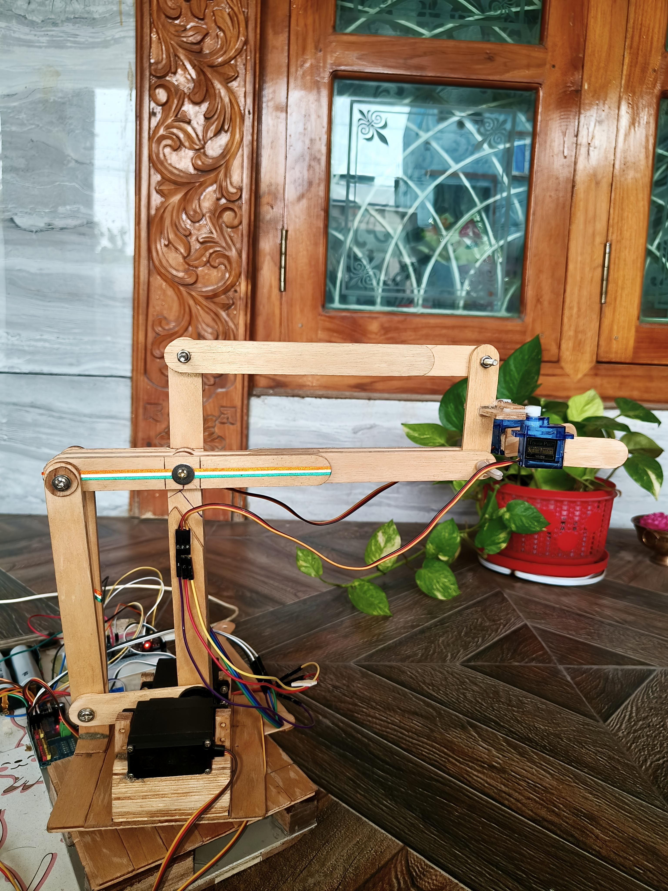 | 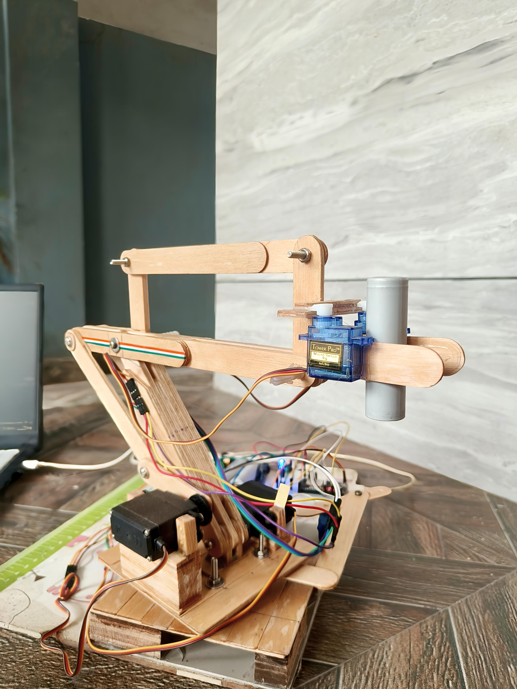 |

---

## ✨ Features

* 🌐 **Self-Hosted Web Interface** – Control the robotic arm from a smartphone, tablet, or computer connected to the ESP32 Wi-Fi network.
* 🎛️ **Real-Time Joint Control** – Control the arm using slider-based controls.
* ⚡ **Motion Smoothing** – Custom acceleration and deceleration algorithms provide smoother movement.
* 💾 **Position Recording** – Save multiple arm positions to the ESP32's flash-backed storage.
* ▶️ **Sequence Playback** – Play, pause, stop, and loop recorded motion sequences.
* ⚙️ **Speed Adjustment** – Adjust the movement speed directly from the web dashboard.
* ✋ **Gripper Control** – Control the gripper opening and closing range.
* 🏠 **Default Position** – Return the arm to a predefined home position.
* 🎯 **Custom Position** – Move the arm to a user-defined position.
* 🌙 **Dark & Light Mode** – Switch between dark and light dashboard themes.
* 🚨 **Emergency Stop** – Immediately stop active arm movements.
* 📱 **Responsive Design** – Designed for both desktop and mobile screens.
* 📶 **Wireless Control** – Operate the arm through the ESP32's built-in Wi-Fi access point.

---

## 🛠️ Hardware Used

| Component                           | Quantity | Purpose                                |
| ----------------------------------- | -------- | -------------------------------------- |
| ESP32 Development Board             | 1        | Main controller and Wi-Fi access point |
| PCA9685 16-Channel PWM Servo Driver | 1        | Servo control                          |
| MG996R Servo                        | 2        | Shoulder and Elbow                     |
| SG90 Servo                          | 3        | Base Rotation and Dual-Servo Gripper   |
| Push Buttons                        | 2        | Gripper Open / Close control           |
| Red LED                             | 1        | Status indication                      |
| Green LED                           | 1        | Status indication                      |
| External 5V Power Supply            | 1        | Servo power                            |
| Mechanical Frame                    | 1        | Robotic-arm structure                  |

> **Note:** Use a properly rated regulated 5V supply for the servo motors. MG996R servos can draw high current under load.

---

## 🔌 Wiring

### PCA9685 Connections

| PCA9685 | ESP32              |
| ------- | ------------------ |
| SDA     | GPIO 21            |
| SCL     | GPIO 22            |
| VCC     | 3.3V               |
| GND     | GND                |
| V+      | External 5V Supply |

> The ESP32 and the external servo power supply should share a **common ground**.

### Push Buttons

| Component         | ESP32 Pin |
| ----------------- | --------- |
| Grip Close Button | GPIO 25   |
| Grip Open Button  | GPIO 26   |

### Status LEDs

| Component | ESP32 Pin |
| --------- | --------- |
| Red LED   | GPIO 13   |
| Green LED | GPIO 14   |

### Servo Channels

| PCA9685 Channel | Servo  | Function        |
| --------------- | ------ | --------------- |
| Channel 0       | MG996R | Shoulder        |
| Channel 1       | MG996R | Elbow           |
| Channel 2       | SG90   | Base Rotation   |
| Channel 3       | SG90   | Gripper Servo 1 |
| Channel 4       | SG90   | Gripper Servo 2 |

---

## 🚀 Installation

### Required Libraries

```cpp
#include <WiFi.h>                    // ESP32 Wi-Fi Access Point
#include <WebServer.h>               // Web control dashboard
#include <Wire.h>                    // I2C communication
#include <Adafruit_PWMServoDriver.h> // PCA9685 servo control
#include <EEPROM.h>                  // Position storage
```

### Arduino IDE Setup

1. Open the project in **Arduino IDE**.
2. Install the **ESP32 Board Package**.
3. Install **Adafruit PWM Servo Driver Library** from the Library Manager.
4. Select your **ESP32 board** and **COM port**.
5. Compile and upload the code.


---

## 💻 Uploading the Code

1. Open the project in Arduino IDE.
2. Install the ESP32 board package.
3. Install the **Adafruit PWM Servo Driver Library**.
4. Select the appropriate ESP32 board.
5. Connect the ESP32 to your computer.
6. Select the correct COM port.
7. Compile the project.
8. Upload the firmware to the ESP32.
9. Open the Serial Monitor to verify the system status.

---

## 📶 Connecting to the Robotic Arm

1. Power on the robotic arm.
2. Connect your smartphone, tablet, or computer to the ESP32 Wi-Fi network.

**SSID:** `RoboticArm_AP`

**Password:** `YOUR_PASSWORD`

3. Open a web browser.
4. Enter:

`http://192.168.4.1`

5. The robotic-arm control dashboard will load.

> **Security:** If this project is published publicly, avoid committing a real Wi-Fi password to the repository. Store it in a configurable section of the firmware or use a placeholder.

---

## 🎮 Usage

| Function           | Controls / Action                                                           |
| ------------------ | --------------------------------------------------------------------------- |
| **Manual Control** | Use sliders to control Base, Shoulder, Elbow, and Gripper.                  |
| **Save Position**  | Click **Save Current Position** to store the current arm position.          |
| **Start**          | ▶️ Start the recorded motion sequence.                                      |
| **Pause**          | ⏸️ Temporarily pause sequence playback.                                     |
| **Stop**           | ⏹️ Stop the current sequence.                                               |
| **Loop**           | 🔁 Continuously repeat the recorded sequence.                               |
| **Settings**       | Adjust Motion Speed, Playback Delay, Motion Smoothness, and Gripper Limits. |
| **Theme**          | 🌙 Dark Mode / ☀️ Light Mode                                                |


---

## 📸 Project Preview

---

## 📸 Prototype Development Gallery

### Working Demonstration

| Object Picking                                          | Object Pick-Up                                          |
| ------------------------------------------------------- | ------------------------------------------------------- |
| 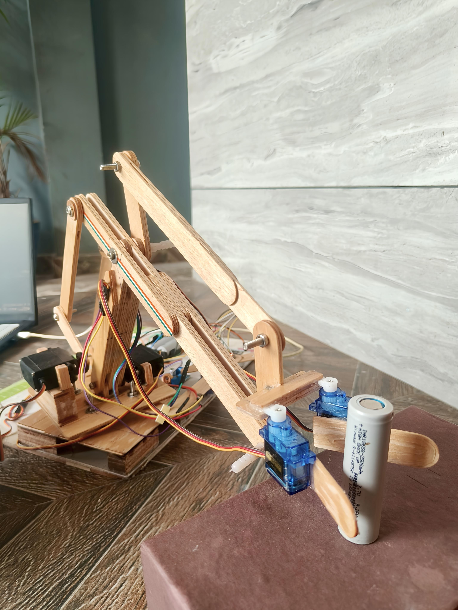 | 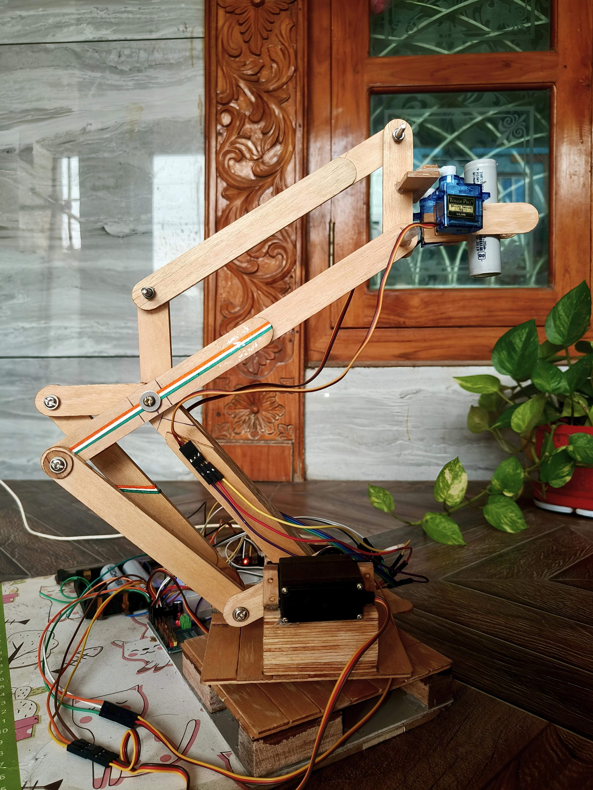 |

---

### CAD Design — Fusion 360

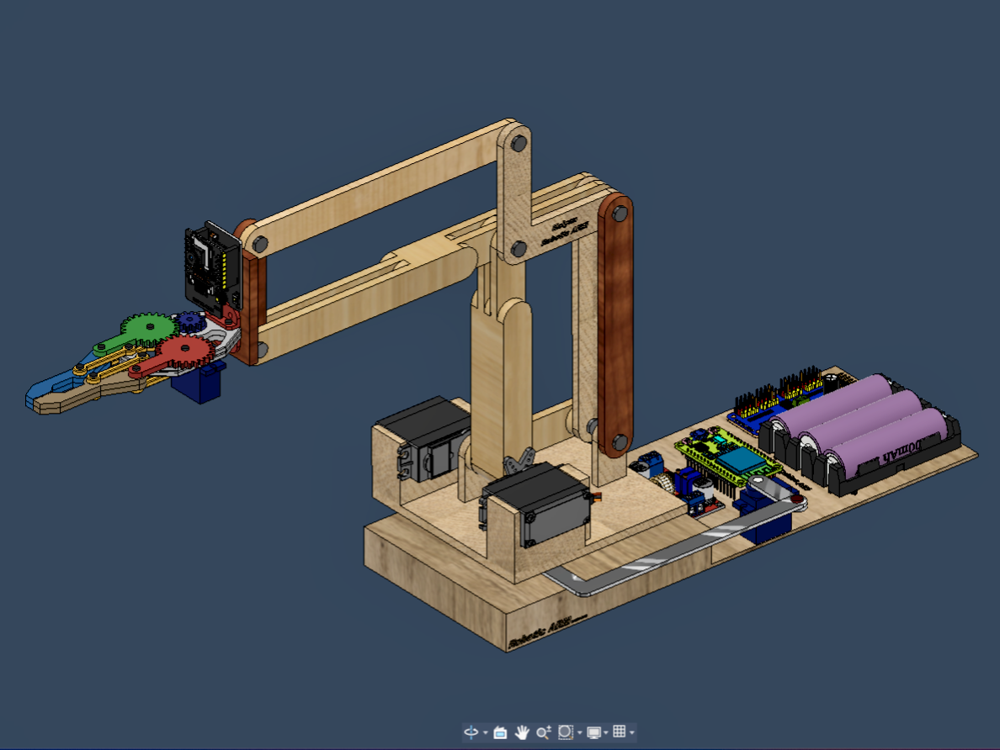

---

### Prototype Parts

The mechanical structure was designed to make the arm relatively easy to assemble and disassemble.

| Assembly Parts                                          |
| ------------------------------------------------------- |
| 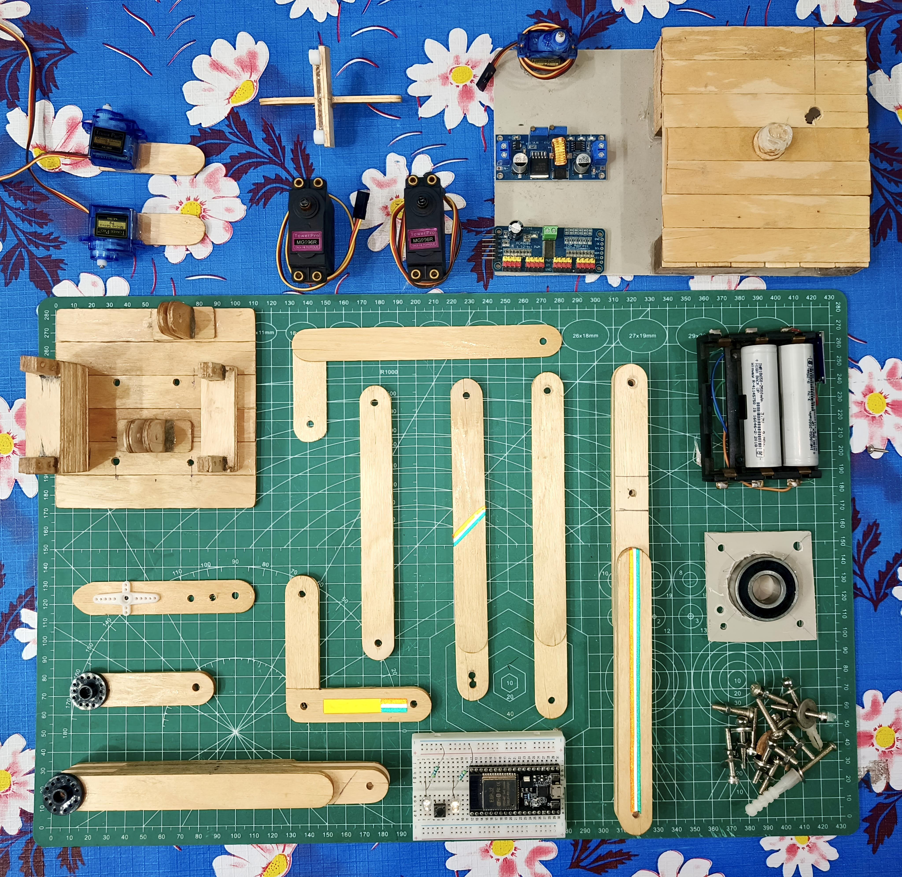 |

---

### Mechanical Drawing

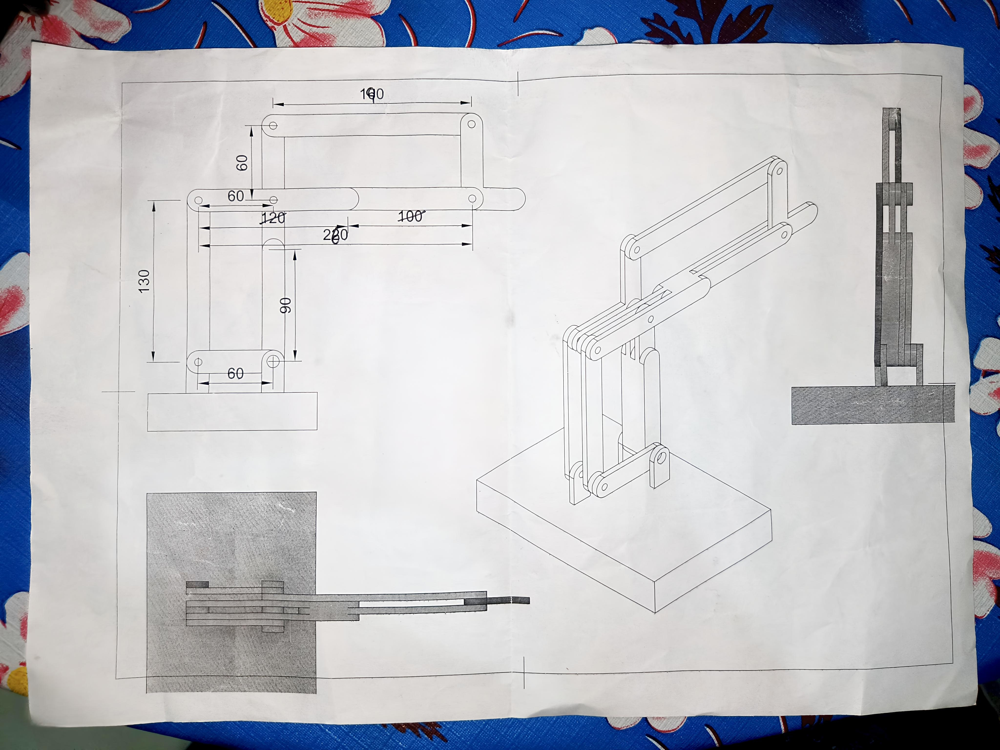

---

### Gripper Mechanism

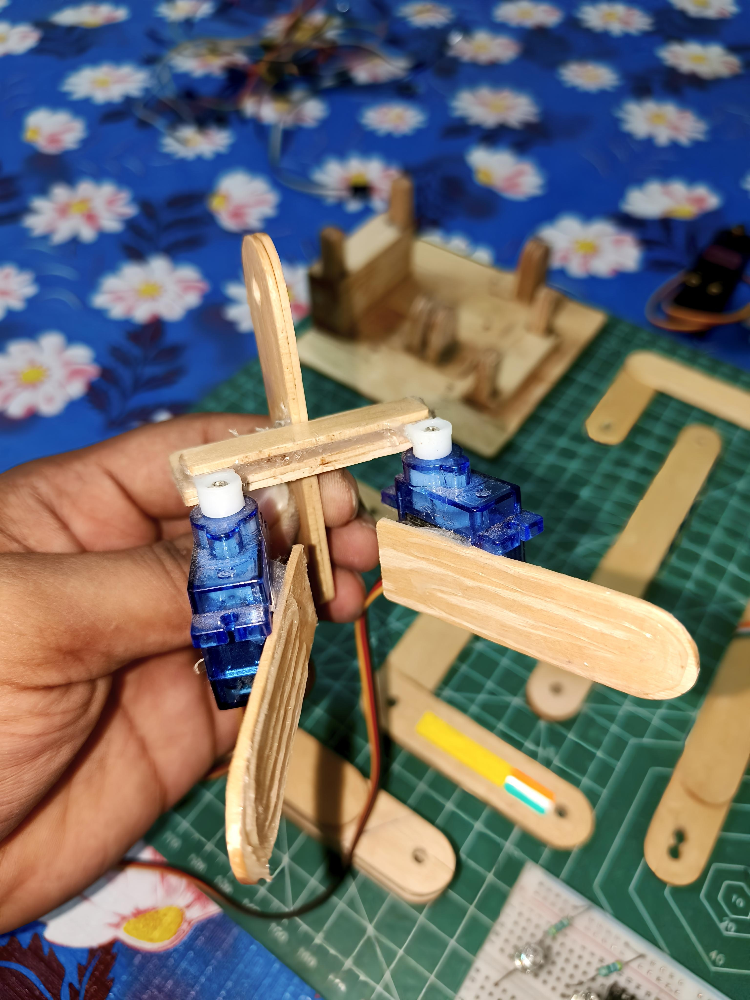

---

### Web Dashboard

| View 1                                            | View 2                                             |
| ------------------------------------------------- | -------------------------------------------------- |
| 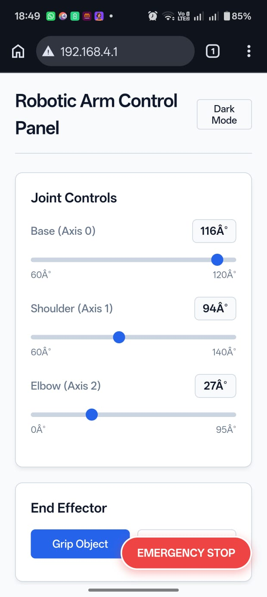 | 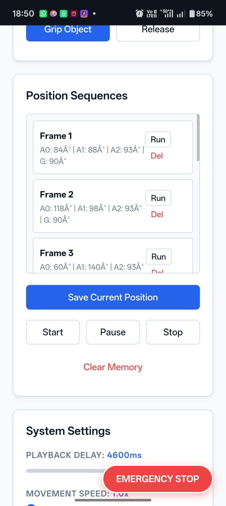 |

---

### Build Process

| Planning Initial Linkage                                | Wooden Parts                                            |
| ------------------------------------------------------- | ------------------------------------------------------- |
| 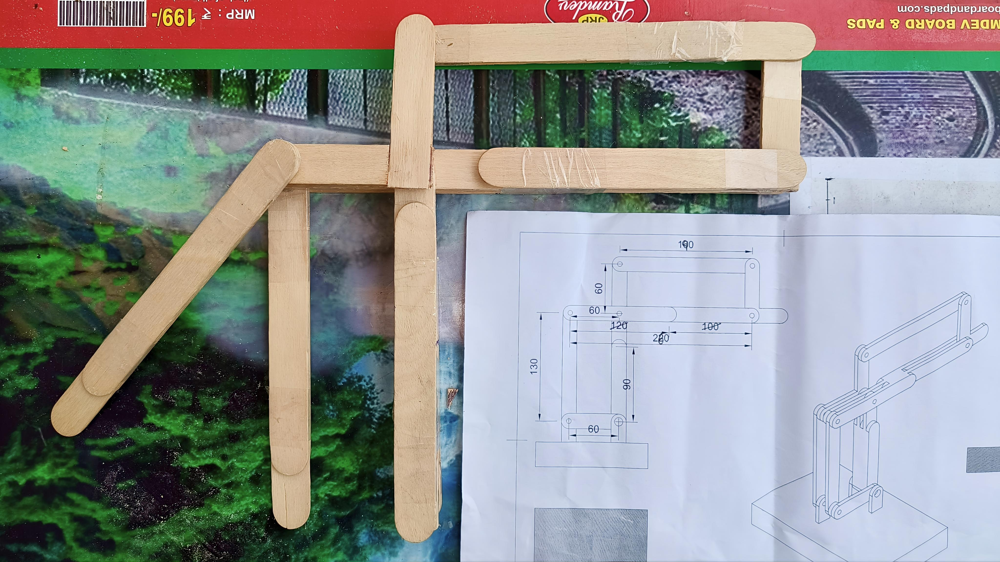 | 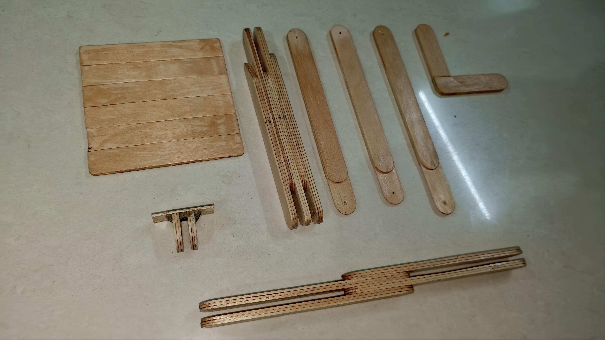 |

---

### Additional Views

| View 1                                                  | View 2                                                  |
| ------------------------------------------------------- | ------------------------------------------------------- |
| 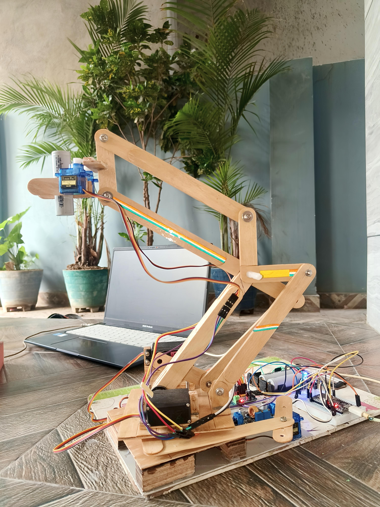 | 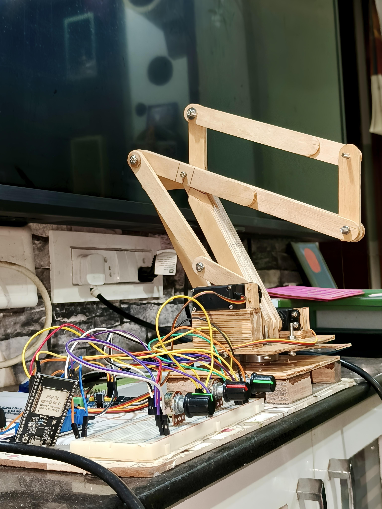 |

---

## 🔮 Future Improvements

* 👁️ Object detection using OpenCV
* 🤖 Automatic pick-and-place operations
* 📱 Dedicated mobile application
* 📐 Inverse kinematics implementation
* 🎙️ Voice-controlled operation
* 🧠 Autonomous object manipulation
* 📡 Remote control over a wider network
* 🎯 Object-position-based motion planning

---

## 📄 License

This project is open-source and available under the **MIT License**.

---

## 👨‍💻 Author

**Lakshmi Pavan Kalyan Imandi**

Electronics and Communication Engineering (ECE) Student | Robotics & Embedded Systems Enthusiast

---

⭐ **If you find this project useful, consider giving the repository a star!**
